# 停云见晴 Weather Inquiry

基于 **HarmonyOS Next (API 24 / 6.1.1)** 的天气应用，对接 [QWeather 和风天气](https://www.qweather.com/) 免费 API。

## 效果展示

### 天气主界面（自动背景切换）

| 晴天 | 阴天 | 雨天 | 雾天 |
|---|---|---|---|
| 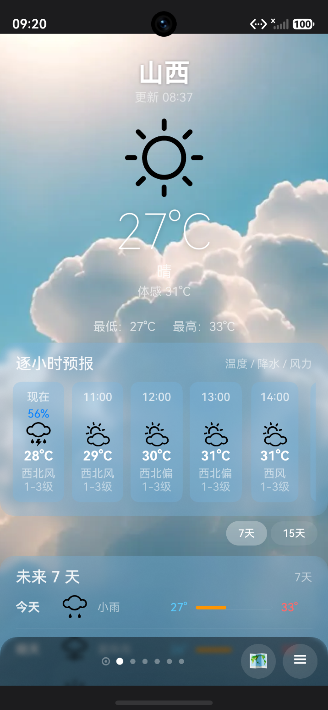 | 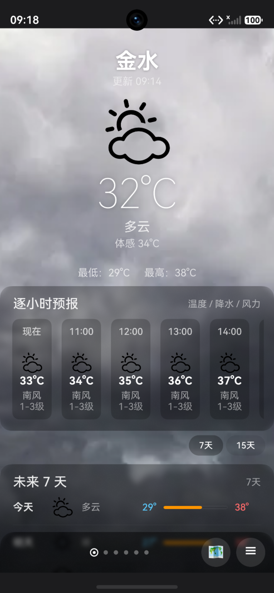 | 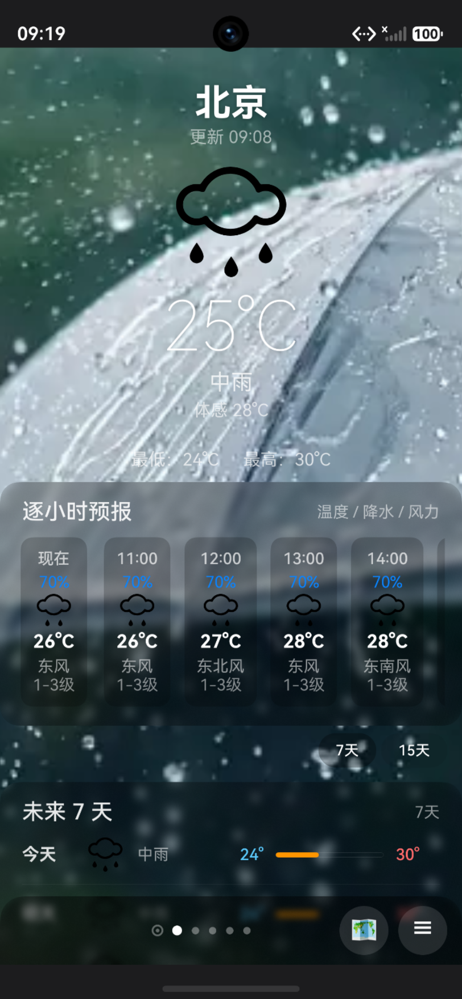 | 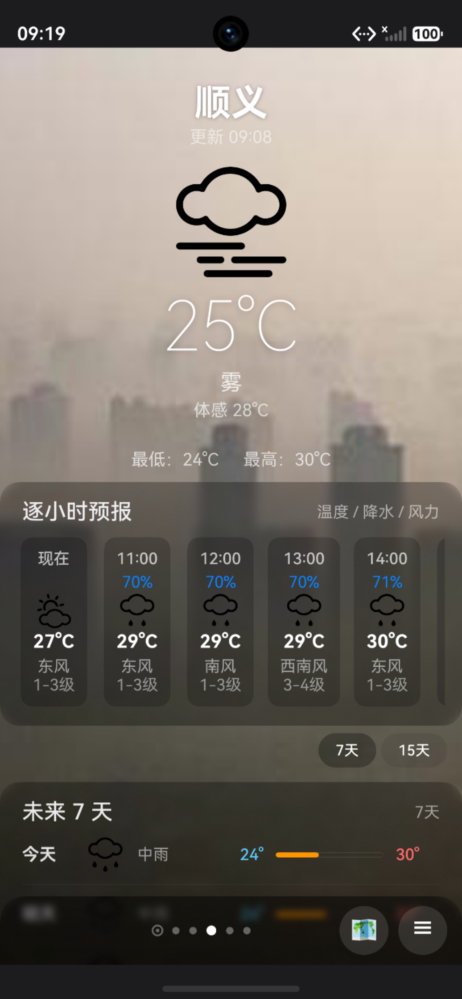 |

### 更多天气信息

| 更多信息 1 | 更多信息 2 |
|---|---|
| 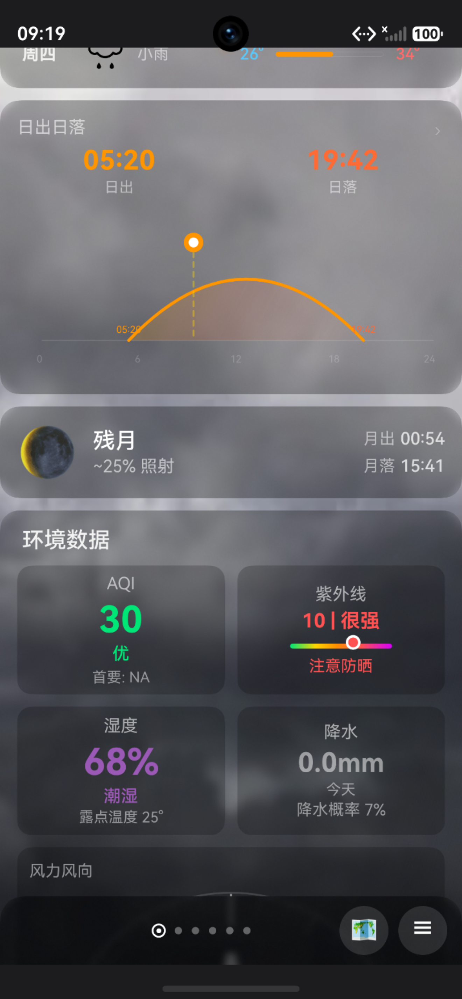 | 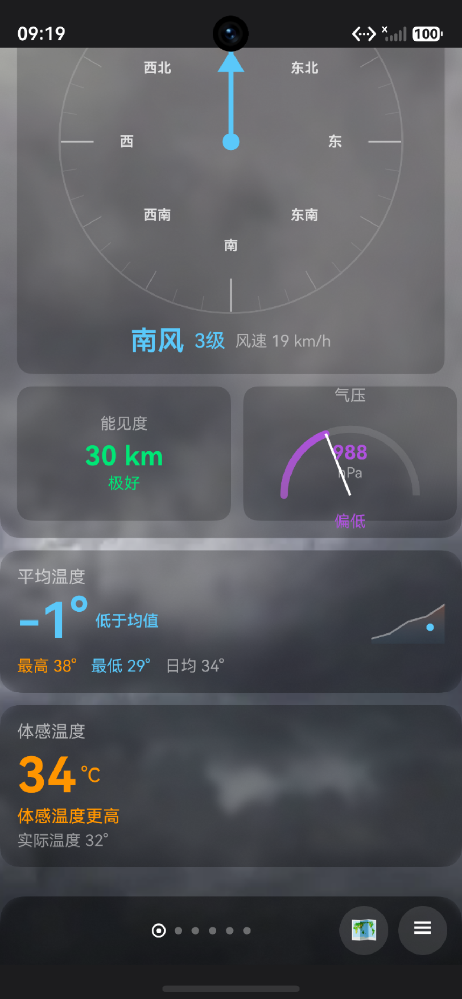 |

### 城市管理

| 城市列表 | 搜索列表 |
|---|---|
| 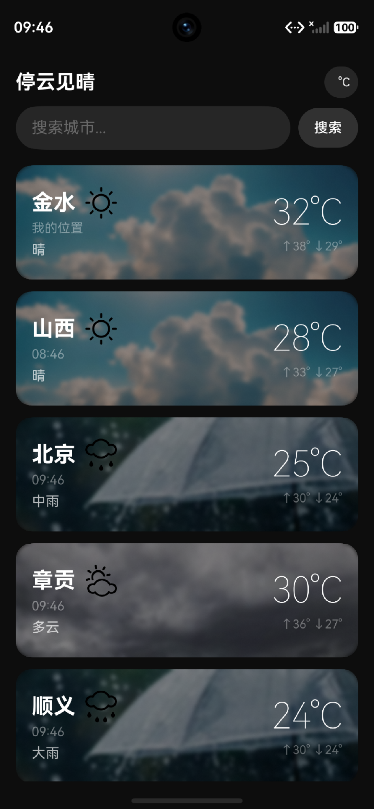 | 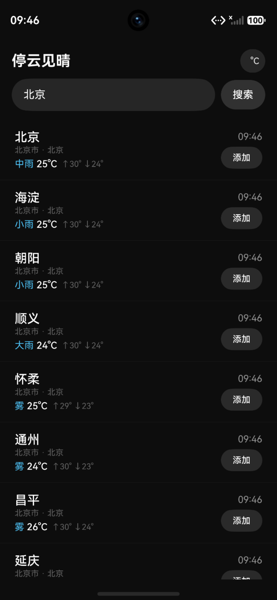 |

### 详情弹窗

| 气温 | 日出日落 | 月相 | AQI |
|---|---|---|---|
| 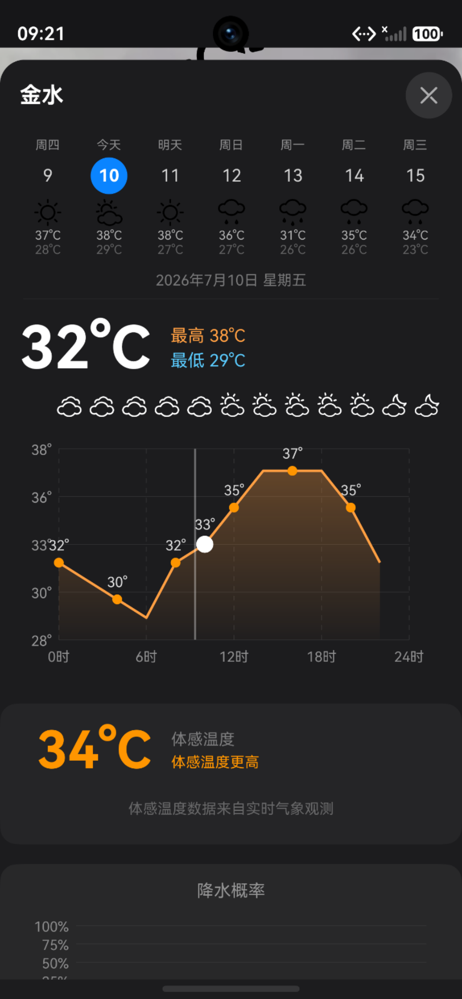 | 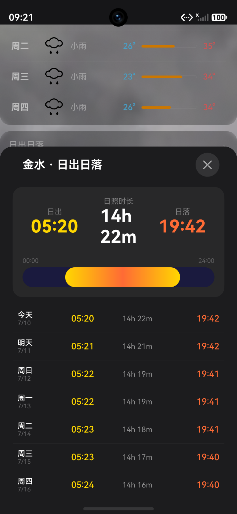 | 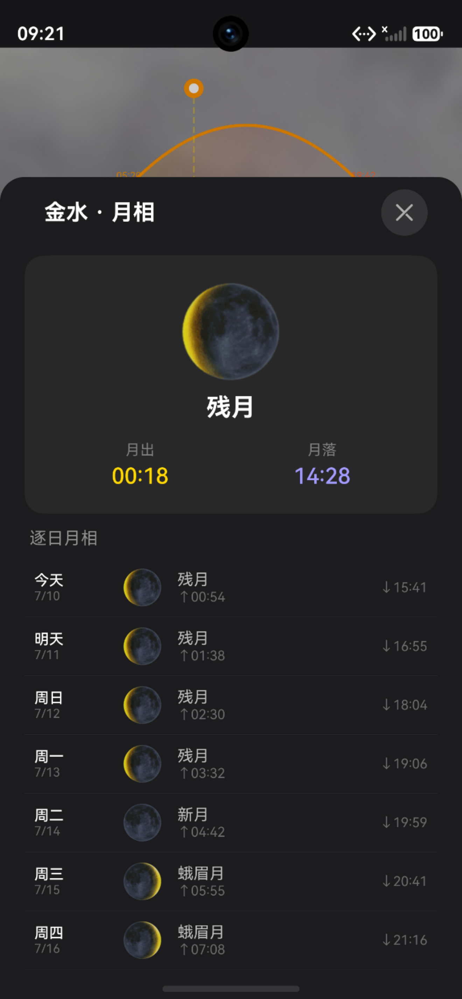 | 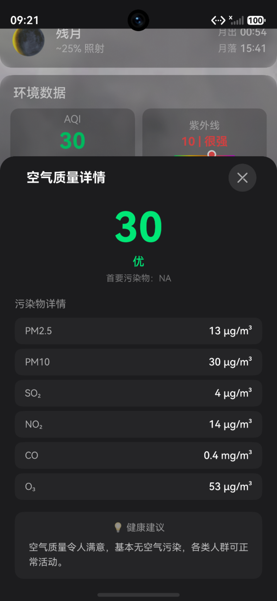 |

| 紫外线 | 湿度 | 风力风向 | 气压 | 可见度 |
|---|---|---|---|---|
| 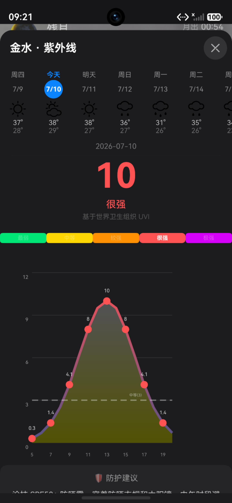 | 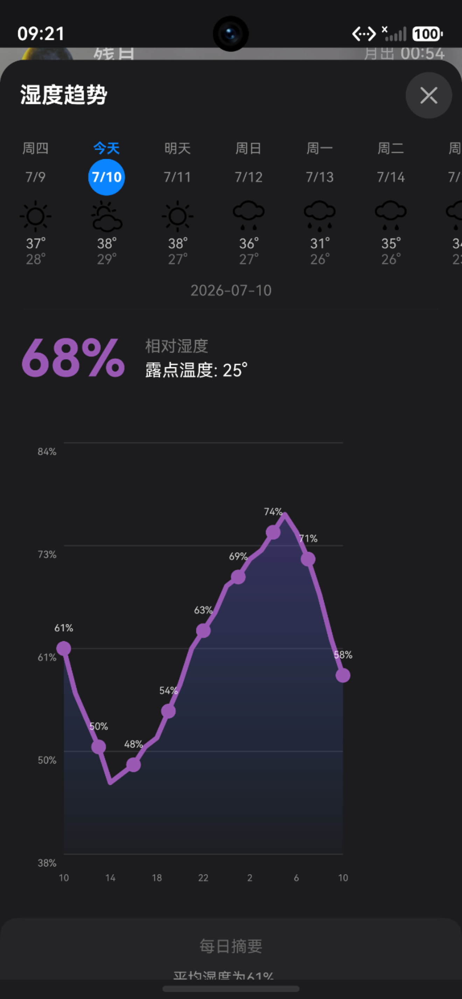 | 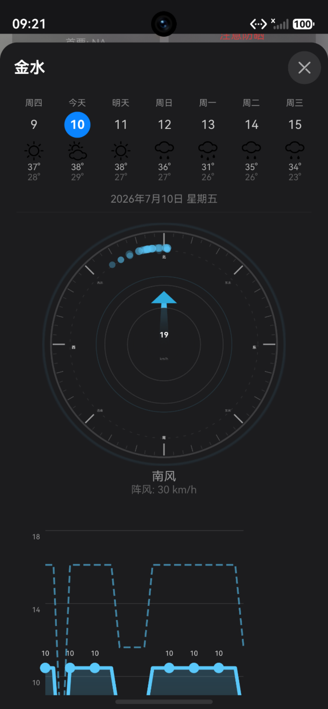 | 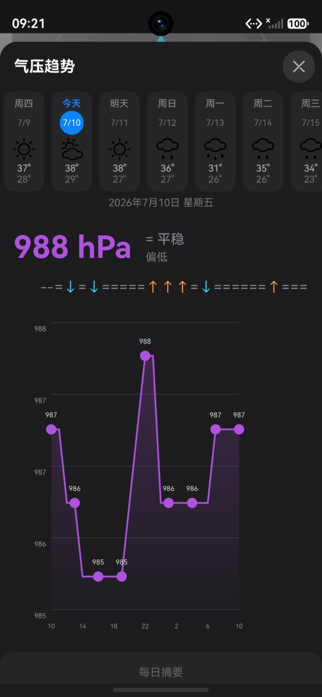 | 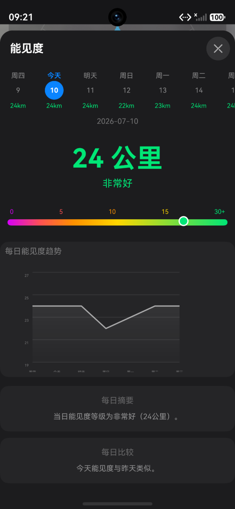 |

---

## 功能特性

| 模块 | 功能 |
|---|---|
| **实时天气** | 天气图标 · 温度 · 天气描述 · 体感温度 · 湿度 · 风向 · 风力 · 降水 |
| **逐小时预报** | 横向滑动列表，未来 24 小时温度、降水概率、风向风力 |
| **7 / 15 天预报** | 日期标签 · 温差可视化指示条 · 日出日落 · 月相 · 一键切换 7 天 / 15 天 |
| **天气预警** | 实时预警横幅，展示预警等级与详情 |
| **环境数据** | AQI 空气质量（含颜色分级 + 本地 HJ 633-2012 回退计算）· 紫外线 · 湿度 · 气压 · 能见度 · 风力风向 · 降水 |
| **详情弹窗** | 10 个底部弹窗：AQI · 紫外线 · 湿度 · 风力 · 能见度 · 气压 · 温度趋势 · 日出日落 · 月相 · 降水 |
| **多城市管理** | Swiper 左右滑动切换 · 城市搜索 · 收藏/删除 · 右滑删除 |
| **自动定位** | GPS 定位 → 天气加载 · 降级回退北京 · 持续定位 + 5 km 阈值自动切换城市 |
| **天气背景** | 10 种天气主题背景（晴/雨/雪/雷/雾/沙/风/多云/夜间/默认），自动昼夜切换 |
| **温度单位** | °C / °F 全局切换，AppStorage 响应式驱动所有组件刷新 |
| **历史对比** | 今日 vs 昨日温差对比，弹窗内展示昨日数据 |
| **下拉刷新** | 手势刷新当前城市天气，自动定位城市同时检查位置变化 |

---

## 快速开始

### 环境要求

- **DevEco Studio** ≥ 5.0.3
- **HarmonyOS SDK** API 24 (6.1.1)
- **targetDevice** 手机 (phone)

### 获取项目

```bash
git clone <你的仓库地址>
cd weather-inquiry
```

### 配置 API

复制模板并填入你的 [QWeather API 密钥](https://dev.qweather.com/)：

```bash
cp entry/src/main/ets/constants/AppConstants.example.ets \
   entry/src/main/ets/constants/AppConstants.ets
```

编辑 `AppConstants.ets`，修改以下两项：

```typescript
export const API_KEY = '你的QWeather密钥'
export const API_BASE = 'https://devapi.qweather.com'
```

然后追加模板中缺失的两个导出（否则编译报错）：

```typescript
export const WEATHER_WARNING_URL = `${API_BASE}/v7/warning/now`
export const PREF_TEMP_UNIT = 'temp_unit'
```

> ⚠️ `AppConstants.ets` 已被 `.gitignore` 排除，不会提交到仓库。每个开发者需自行创建并补充以上两行。

### 构建运行

1. 用 DevEco Studio 打开项目根目录
2. 等待依赖同步完成（ohpm install）
3. 连接真机或启动模拟器
4. 点击 `Run 'entry'` 或 `Ctrl + F5`

---

## 项目结构

```
weather-inquiry/
├── AppScope/
│   ├── app.json5                           # 应用配置（bundleName · 版本号）
│   └── resources/                          # 应用级资源（图标 · 字符串）
├── entry/src/main/
│   ├── ets/
│   │   ├── api/
│   │   │   └── WeatherApi.ets              # HTTP 请求封装 · 8 个 API 函数
│   │   ├── components/
│   │   │   ├── CurrentWeatherCard.ets      # 实时天气卡片
│   │   │   ├── HourlyForecast.ets          # 逐小时横向滑动预报
│   │   │   ├── ForecastList.ets            # 7/15 天预报列表（含温差条）
│   │   │   ├── EnvironmentCards.ets        # 环境数据网格（AQI/UV/湿度/风力/能见度/气压/降水）
│   │   │   ├── SunriseSetCard.ets          # 日出日落卡片
│   │   │   ├── MoonCard.ets                # 月相卡片
│   │   │   ├── WarningBanner.ets           # 天气预警横幅
│   │   │   ├── AverageTempCard.ets         # 日均温度卡片
│   │   │   ├── FeelsLikeCard.ets           # 体感温度卡片
│   │   │   ├── DetailDialogs.ets           # 详情弹窗共享 Payload (@Observed V1)
│   │   │   └── *DetailDialog.ets (×8)      # AQI · UV · 湿度 · 风力 · 能见度 · 气压 · 日出 · 月相 弹窗
│   │   ├── constants/
│   │   │   ├── AppConstants.ets            # 🔒 API 密钥与端点（不入库）
│   │   │   └── AppConstants.example.ets    # API 配置模板
│   │   ├── entryability/
│   │   │   └── EntryAbility.ets            # Ability 入口（预设 tempUnit · 沉浸式状态栏）
│   │   ├── model/
│   │   │   └── WeatherModel.ets            # 数据接口（13 接口 + 1 枚举 + 7 响应类型）
│   │   ├── pages/
│   │   │   ├── Index.ets                   # 🏠 主页面（Swiper + Refresh + 10 个弹窗）
│   │   │   └── SearchPage.ets              # 🔍 城市搜索与管理页
│   │   ├── services/
│   │   │   ├── LocationService.ets         # GPS 定位 + 持续监听（5 km/30 s 防抖）
│   │   │   ├── FavoriteCityManager.ets     # 收藏城市持久化 (weather_favorites)
│   │   │   ├── TemperatureService.ets      # 温度单位单例 (weather_settings)
│   │   │   └── WeatherHistoryService.ets   # 今日/昨日快照 (weather_history)
│   │   └── utils/
│   │       ├── WeatherUtils.ets            # 图标/背景/日期/格式化
│   │       └── AqiCalculator.ets           # AQI 本地计算（HJ 633-2012）
│   ├── module.json5                        # 模块配置（权限 · Ability）
│   └── resources/
│       └── rawfile/                        # 55 个天气图标 SVG
├── build-profile.json5                     # 构建配置（签名 · SDK 版本 · 严格模式）
├── code-linter.json5                       # 代码检查规则
├── oh-package.json5                        # 依赖声明
└── README.md
```

---

## 技术架构

### 状态管理（V1 + V2 混合）

| 层级 | 机制 | 用途 |
|---|---|---|
| `CityWeatherState` | `@ObservedV2` + `@Trace` (V2) | 属性级精确刷新，避免全量重渲染 |
| `Index` 页面 | `@State` / `@StorageLink` (V1) | 页面级状态、温度单位全局绑定 |
| `DetailPayload` | `@Observed` (V1) | 10 个详情弹窗共享的数据载荷 |

> V1 与 V2 设计上可互操作，**勿转换**——混用是有意为之。

### 数据流

```
LocationService (GPS / 降级北京 39.9, 116.4)
      │
      ▼
  WeatherApi.cityLookup() → cityId
      │
      ▼
  Promise.allSettled([           ← 6 个并行请求
    getCurrentWeather(),
    getForecast(),
    getHourlyForecast(),
    getAirQuality(),
    getWeatherWarning(),
    getForecast15D()
  ])
      │
      ▼
  CityWeatherState (@Trace 字段更新) → UI 组件自动刷新
      │
      ├→ CurrentWeatherCard / HourlyForecast / ForecastList
      ├→ EnvironmentCards / SunriseSetCard / MoonCard / WarningBanner
      └→ AverageTempCard / FeelsLikeCard
```

### API 接口

| 接口 | URL | 说明 |
|---|---|---|
| 城市搜索 | `/geo/v2/city/lookup` | 按坐标或关键词查找城市 |
| 实时天气 | `/v7/weather/now` | 温度、天气、体感、风力 |
| 7 天预报 | `/v7/weather/7d` | 含日出日落、月相 |
| 15 天预报 | `/v7/weather/15d` | 同 7 天结构 |
| 逐小时预报 | `/v7/weather/24h` | 未来 24 小时 |
| 空气质量 | `/v7/air/now` | AQI + 污染物浓度 |
| 天气预警 | `/v7/warning/now` | 实时预警列表 |

### 权限声明

| 权限 | 用途 |
|---|---|
| `ohos.permission.INTERNET` | 网络请求 |
| `ohos.permission.LOCATION` | 精确定位 |
| `ohos.permission.APPROXIMATELY_LOCATION` | 模糊定位降级 |

### 关键设计决策

- **图标资源**：`getWeatherIconResource()` 使用 `switch` 返回 `$rawfile()`，因 ArkTS 的 `Map` + `$rawfile()` 存在已知问题。
- **背景图片**：从外部 CDN 加载（`WEATHER_BACKGROUNDS` 常量定义），不随包内置。
- **AQI 回退**：免费订阅可能不返回空气质量数据，`AqiCalculator` 按 HJ 633-2012 标准本地计算。
- **温度单位**：Preferences 存储 `'CELSIUS'`/`'FAHRENHEIT'`，AppStorage 映射为 `'°C'`/`'°F'`，组件通过 `@StorageLink('tempUnit')` 响应式绑定。
- **弹窗共享**：10 个 `CustomDialogController` 共用一个 `DetailPayload` 实例，打开前调用 `prepareEnvPayload(state)` 填充数据。

---

## License

Apache-2.0 license
